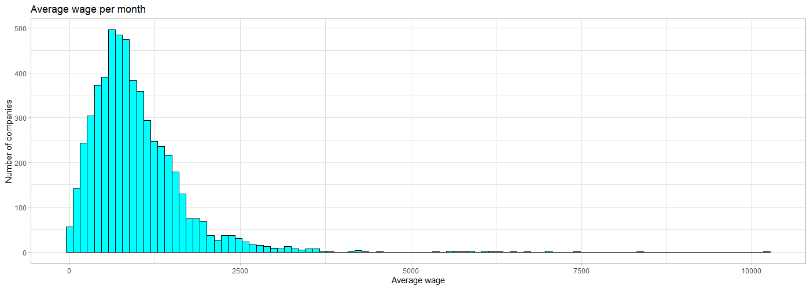
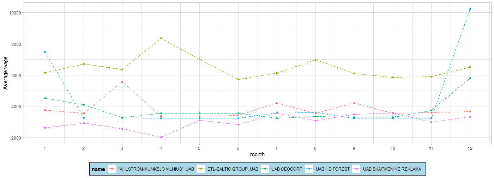
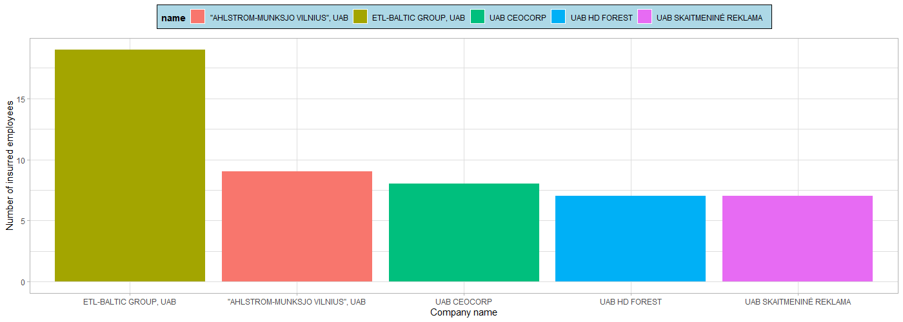
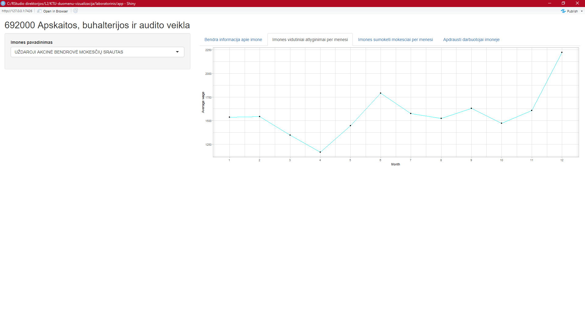

# R Laboratorinis darbas: duomenų vizualizacija

| Variantas | ecoActCode |
|------------- | ------------- |
|15   | 692000 |

### 1. Užduotis

Atsakymas:

Išvados: Apskaitos, buhalterijos ir audito veiklos imonese maziausias vidutinis atlyginimas 3.87 eurai, vidutinis 967.17, o didziausias 10223.43.

### 2. Užduotis

Atsakymas:

Išvados: Top 5 imones, kuriu vidutiniai atlyginimai didziausi: UAB HD FOREST, ETL-BALTIC GROUP, UAB, UAB CEOCORP, "AHLSTROM-MUNKSJO VILNIUS", UAB, UAB SKAITMENINE REKLAMA. Daugmaz visu imoniu vidutiniai atlyginimai svyravo visus metus. Didziausius suolius padare imone UAB HD FOREST metu pradzioje ir pabaigoje. Taip tuo laiku suolius turejo ir imone UAB CEOCORP, taciau zenkliai mazesnius.

### 3. Užduotis

Atsakymas:

Išvados: Is pries tai minetu imoniu daugiausiai apdraustu darbuotoju turi imone ETL-BALTIC GROUP, UAB (16), kitos stabiliai nuo 8 iki 5.

### 4. Užduotis

Shiny R aplikacijos nuotrauka:

